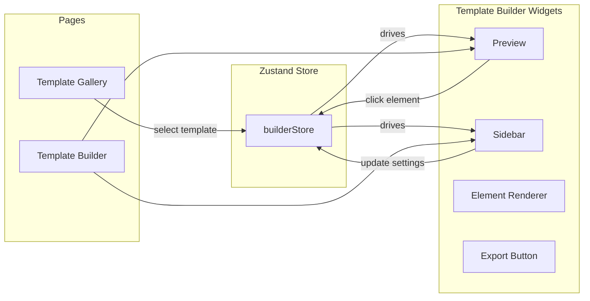

# Flodesk Page Builder

## Architecture Overview



## Key Decisions

- **Grain is the UI framework** for all builder chrome (sidebar controls, buttons, layout). Template preview content uses inline styles so it can be exported cleanly.
- **No hard-coded colors or spacing in SCSS** -- use Grain CSS variables everywhere: `var(--grn-color-*)` for colors, `var(--grn-space-*)` for spacing, `var(--grn-radius-*)` for border radius, `var(--grn-shadow-*)` for shadows, `var(--grn-transition-*)` for transitions. Only the template seed data (which becomes user-editable content) uses hex values.
- **No color picker in Grain** -- use a native `<input type="color">` wrapped in a thin component styled to blend with Grain.
- **Templates are data-driven** -- each template is a JSON-like structure of sections and leaf elements with default settings. This keeps the model simple while still supporting richer layouts like a 3-column highlights row.
- **Export** serializes the current section/element tree + settings into a self-contained HTML string with all styles inlined. No remote assets or web fonts are required for the exported file to render correctly.

## Dependencies to Install

- `@flodesk/grain` (design system)
- `@floating-ui/react-dom-interactions` (Grain peer dep)
- `@headlessui/react@1.7.17` (Grain peer dep, pinned version)
- `zustand` (state management)
- `react-router-dom` (routing)
- `sanitize-html` + `@types/sanitize-html` (XSS prevention for user content)
- `sass` (SCSS support)
- `typescript` (already has `@types/react` and `@types/react-dom` in devDeps)

## File Structure

```
tsconfig.json                             -- TypeScript config (strict, JSX react-jsx)
tsconfig.app.json                         -- App-specific TS config extending base
tsconfig.node.json                        -- Node/Vite config TS settings
vite.config.ts                            -- Vite config (renamed from .js)

src/
  main.tsx                                -- entry, wraps App in GrainProvider + BrowserRouter
  app.tsx                                 -- defines routes: "/" -> Gallery, "/:id" -> Template Builder
  vite-env.d.ts                           -- Vite client type reference
  grain.d.ts                              -- type declarations for @flodesk/grain (untyped package)

  types/
    template.ts                           -- shared interfaces: Template, TemplateSection, TemplateElement, etc.

  store/
    builder-store.ts                      -- Zustand store: template data, selected element, settings

  styles/
    main.scss                             -- single stylesheet using BEM naming: block__element--modifier (e.g. .template-gallery, .template-gallery__card, .template-gallery__card--active, .template-builder__preview, .sidebar__section, .color-picker__swatch)

  pages/
    template-gallery/                     -- PAGE: template selection
      template-gallery.tsx
      template-card.tsx                   -- widget: single template card with mini-preview
    template-builder/                     -- PAGE: the builder
      template-builder.tsx                -- main layout (toolbar + preview + sidebar)
      preview.tsx                         -- widget: live preview panel
      sidebar.tsx                         -- widget: settings panel
      export-button.tsx                   -- widget: HTML export trigger

  components/
    element-renderer.tsx                  -- shared: renders a single template element (used by gallery cards + builder preview)
    template-preview.tsx                  -- shared: renders a full template as HTML (sections + elements + page styles), used by both gallery thumbnail and builder preview
    color-picker.tsx                      -- shared: thin wrapper around native <input type="color">

  constants/
    font-presets.ts                       -- friendly typography presets mapped to local/system font stacks for preview + export
    templates.ts                          -- seed data: all template definitions (portfolio + event launch), used as initial data for the Zustand store

  utils/
    sanitize.ts                           -- wraps sanitize-html with app-specific config (allowed tags, no scripts/event handlers)
    export-to-html.ts                     -- builds the full HTML string from current state
```

## Data Model (`src/types/template.ts`)

> Note: TypeScript interfaces/types keep PascalCase per convention. Only file and folder names use lowercase-with-dashes.

Shared TypeScript interfaces used across the app:

```typescript
export interface ElementSettings {
  fontSize: string;
  color: string;
  textAlign: 'left' | 'center' | 'right';
  padding: string;
  backgroundColor: string;
  borderRadius?: string;
  fontWeight?: string;
  letterSpacing?: string;
  lineHeight?: string;
}

export type FontPreset = 'modern-sans' | 'editorial-serif' | 'classic-serif' | 'mono';
export type ElementType = 'heading' | 'text' | 'image' | 'button' | 'divider';

export interface BaseElement<T extends ElementType, D> {
  id: string;
  type: T;
  settings: ElementSettings;
  data: D;
}

export type TextElement = BaseElement<'text', {
  text: string;
}>;

export type HeadingElement = BaseElement<'heading', {
  text: string;
  level: 1 | 2 | 3;
}>;

export type ButtonElement = BaseElement<'button', {
  label: string;
  href?: string;
  target?: '_self' | '_blank';
}>;

export type ImageElement = BaseElement<'image', {
  src: string;
  alt: string;
  decorative?: boolean;
  width?: number;
  height?: number;
  sourceType?: 'placeholder' | 'upload';
}>;

export type DividerElement = BaseElement<'divider', Record<string, never>>;

export type TemplateElement =
  | TextElement
  | HeadingElement
  | ButtonElement
  | ImageElement
  | DividerElement;

export interface SectionSettings {
  padding: string;
  backgroundColor?: string;
  borderRadius?: string;
}

export interface TemplateColumn {
  id: string;
  elements: TemplateElement[];
}

export interface TemplateSection {
  id: string;
  layout: 'stack' | 'columns';
  gap: string;
  settings: SectionSettings;
  elements?: TemplateElement[];      // used when layout === 'stack'
  columns?: TemplateColumn[];        // used when layout === 'columns'
}

export interface PageSettings {
  backgroundColor: string;
  fontPreset: FontPreset;
  maxWidth: string;
}

export interface Template {
  id: string;
  name: string;
  description: string;
  pageSettings: PageSettings;
  sections: TemplateSection[];
}
```

`constants/font-presets.ts` exports a `FONT_STACKS` map so both preview and export resolve the same local/system-safe `font-family` values:

```typescript
export const FONT_STACKS: Record<FontPreset, string> = {
  'modern-sans': '-apple-system, BlinkMacSystemFont, "Segoe UI", Helvetica, Arial, sans-serif',
  'editorial-serif': 'Baskerville, Georgia, "Times New Roman", Times, serif',
  'classic-serif': 'Georgia, "Times New Roman", Times, serif',
  mono: 'ui-monospace, SFMono-Regular, Menlo, Monaco, Consolas, monospace',
};
```

This `data`-per-type shape avoids invalid states like an image with no `src`, a button with no label, or text nodes carrying image-only fields. Rendering stays explicit: text-like elements read from `data.text` / `data.label`, while images read from `data.src` / `data.alt`.

## Zustand Store (`builder-store.ts`)

State shape:

- `templateMap`: `Record<string, Template>` -- seeded from `constants/templates.ts` at store creation, keyed by template id. Serves both the gallery (listing/previews) and the builder (editing). Mutations go directly into the map so gallery previews stay in sync.
- `selectedElementId`: `string | null` -- tracks which element is selected in the builder

Actions:

- `selectElement(elementId)` -- sets `selectedElementId`
- `updatePageSettings(templateId, patch)` -- merges partial page settings into `templateMap[templateId]`
- `updateElementSettings(templateId, elementId, patch)` -- walks `sections` (and `columns` when present) to merge partial settings into the matching leaf element
- `updateTextLikeData(templateId, elementId, patch)` -- walks `sections` / `columns`, sanitizes plain text fields, then stores updates for text / heading / button elements (`data.text`, `data.label`, optional `data.href`)
- `updateImageData(templateId, elementId, patch)` -- updates image metadata fields like `data.alt`, `data.decorative`, `data.width`, `data.height`
- `updateElementImage(templateId, elementId, file: File)` -- reads file via `FileReader.readAsDataURL()`, then stores the base64 data URL in `image.data.src` and marks `sourceType: 'upload'`
- `resetTemplate(templateId)` -- re-seeds a single template from the original constants (reset to defaults)

The active template id comes from the URL (`useParams()`), not the store. Components use `templateMap[id]` to read data.

Section layout is template-defined in v1. Users can edit page settings and leaf element settings, but they do not add/reorder sections or columns. This keeps the scope aligned with the assignment while still supporting more interesting templates.

Routing is handled by `react-router-dom`, not by the store. The store only owns data; navigation lives in components via `useNavigate()`.

### Routes (`app.tsx`)

- `/` -- `<TemplateGallery />` -- reads `Object.values(templateMap)` for listing. Card click navigates to `/${id}`
- `/:id` -- `<TemplateBuilder />` -- reads `id` from `useParams()`, gets `templateMap[id]`. If `id` doesn't exist in the map, redirect to `/` via `<Navigate to="/" />`
- Back button: `navigate('/')`; browser back button works naturally
- No `selectTemplate` action needed -- the URL is the source of truth for which template is active
- Benefit: URLs like `/portfolio` or `/event-launch` are shareable and bookmarkable. Gallery previews reflect any edits since they read from the same `templateMap`

## UI Design: Template Gallery

Full-screen centered layout. Uses `background2` for the page background to feel like a workspace.

```
+------------------------------------------------------------------+
|                                                                    |
|              Choose a template                                     |
|              Pick a starting point for your page                   |
|                                                                    |
|    +------------------------+    +------------------------+        |
|    |                        |    |                        |        |
|    |   (live mini-preview   |    |   (live mini-preview   |        |
|    |    of template,        |    |    of template,        |        |
|    |    rendered at scale)  |    |    rendered at scale)  |        |
|    |                        |    |                        |        |
|    +------------------------+    +------------------------+        |
|    | Portfolio              |    | Event Launch            |        |
|    | Clean, minimal page    |    | Bold, vibrant page      |        |
|    +------------------------+    +------------------------+        |
|                                                                    |
|    +------------------------+                                      |
|    |                        |                                      |
|    |   (live mini-preview   |                                      |
|    |    of template,        |                                      |
|    |    rendered at scale)  |                                      |
|    |                        |                                      |
|    +------------------------+                                      |
|    | Restaurant             |                                      |
|    | Warm, elegant page     |                                      |
|    +------------------------+                                      |
|                                                                    |
+------------------------------------------------------------------+
```

**Grain components used:**
- Outer wrapper: `Box` with `backgroundColor="background2"`, full viewport height via SCSS (`min-height: 100vh`), centered content with `padding="xxl"`
- Heading: `Text size="xxl" weight="medium"` + `Text size="m" color="content2"` for subtitle
- Card grid: `Arrange columns="repeat(auto-fit, minmax(320px, 1fr))" gap="l"` -- responsive, 2 columns on desktop, stacks on narrow screens
- Each card (`template-card.tsx`): `Card` with `borderSide="all"`, `cursor="pointer"`, `shadowHover="m"`, `transition="fast"`, `padding={0}`, `overflow="hidden"`
  - **Top area -- live HTML thumbnail**: a `Box` with fixed height and `overflow="hidden"`. Inside, `<TemplatePreview>` renders the real template sections and elements at full size, wrapped in a container with `transform: scale(0.35)` + `transform-origin: top left` + `pointer-events: none` (non-interactive). The outer box crops the scaled content, creating a miniature but pixel-accurate preview. Since it reads from `templateMap`, any edits the user made are reflected here.
  - **Bottom area**: `Box padding="l"` with `Text weight="medium"` for name and `Text size="s" color="content2"` for description

## UI Design: Template Builder

Full viewport layout. Sidebar on the right, preview takes remaining space.

```
+------------------------------------------------------+-----------+
| [<- Back]              Preview               [Export]|  Sidebar  |
+------------------------------------------------------+           |
|                                                      |  Page     |
|          +----------------------------+              | [Settings]|
|          |                            |              |           |
|          |     Template preview       |              | Bg color  |
|          |     (live, full size)      |              | [#fff]    |
|          |                            |              |           |
|          |  +----------------------+  |              | Font      |
|          |  | selected element     |  |              | [Inter v] |
|          |  | (dashed border)      |  |              |           |
|          |  +----------------------+  |              | Max width |
|          |                            |              | [---o---] |
|          |                            |              |           |
|          +----------------------------+              +-----------+
|                                                      | Element   |
|                                                      | [Settings]|
|                                                      |           |
|                                                      | Content   |
|                                                      | [______]  |
|                                                      |           |
|                                                      | Font size |
|                                                      | [---o---] |
|                                                      |           |
|                                                      | Color     |
|                                                      | [#1a1a1a] |
|                                                      |           |
|                                                      | Align     |
|                                                      | [L] [C] [R]
|                                                      +-----------+
```

### Top Toolbar
- `Arrange justifyContent="space-between" alignItems="center"` with `height={7}` (56px), `paddingX="l"`, `borderSide="bottom"`
- Left: `TextButton icon={<IconArrowLeft />}` labeled "Back" -- calls `navigate('/')`
- Center: `Text weight="medium"` showing template name
- Right: `Button variant="accent" icon={<IconDownload />}` labeled "Export HTML"

### Preview Panel (flex: 1, takes remaining space)
- `Box` with `backgroundColor="background2"`, full height, `overflow="auto"`, `padding="xl"`
- Inner content wrapper: `Box` centered with `margin="0 auto"`, `maxWidth` from page settings, `backgroundColor` from page settings, `shadow="m"`, `radius="m"` -- simulates the actual page
- Each section rendered by `<TemplatePreview>` using inline layout styles:
  - `stack` sections render a vertical flow container
  - `columns` sections render a CSS grid with `grid-template-columns: repeat(columnCount, minmax(0, 1fr))`
  - Each column renders its own leaf elements in order
- Each leaf element rendered via `ElementRenderer` with:
  - On hover: subtle `outline: 1px solid var(--grn-color-border2)` via SCSS `:hover`
  - When selected: `outline: 2px dashed var(--grn-color-selection)` + `background: var(--grn-color-overlay)`
  - `cursor: pointer` on all elements
  - `onClick` calls `selectElement(id)`
- Click on the page background (outside elements) calls `selectElement(null)` to deselect

### Sidebar Panel (right, fixed 320px)
- `Box width="320px" minWidth="320px"` with `borderSide="left"`, `backgroundColor="background"`, full viewport height, `overflowY="auto"`
- **Tab section**: `TabGroup hasFullWidth` with two tabs: "Page" and "Element"
  - Tabs use `Tab` with `onClick` + `isActive` state
- **Page Settings tab** content: `Stack gap="l" padding="l"`
  - Each setting is a labeled group: `Stack gap="xs"` with `Text size="s" weight="medium" color="content2"` as label
  - Background color: `ColorPicker` (custom component -- native `<input type="color">` + `GhostInput` showing hex value with `prefix="#"`)
  - Typography preset: `Select` with friendly labels like Modern Sans, Editorial Serif, Classic Serif, Mono. The selected option maps to a local/system font stack via `FONT_STACKS`, so preview and export stay identical without any network dependency.
  - Max width: `Slider min={600} max={1200} step={20}` with live value display via `GhostInput` suffix "px"
- **Element Settings tab** content: `Stack gap="l" padding="l"`
  - Empty state (no element selected): `Box padding="xl"` with `Text align="center" color="content3"` saying "Click an element in the preview to edit it"
  - When element selected, show controls based on element type:
    - **Content** (text types): `Textarea` for paragraphs editing `data.text`; `TextInput` for headings (`data.text`) and buttons (`data.label`)
    - **Heading level** (heading type): `Select` for `h1`, `h2`, `h3`, stored in `data.level`
    - **Button link** (button type): optional `TextInput` for `data.href` and `Select` for `data.target`
    - **Image source** (image type): shows current image thumbnail + `Button` labeled "Replace image" that triggers a hidden `<input type="file" accept="image/*">`. On file select, `FileReader.readAsDataURL()` converts it to a base64 data URL stored in `image.data.src`. This base64 string is what gets embedded in the exported HTML, making it fully self-contained.
    - **Image alt text** (image type): `TextInput` bound to `image.data.alt`; decorative images use an empty string
    - **Font size**: `Slider min={12} max={72}` with `GhostInput` value display
    - **Text color**: `ColorPicker`
    - **Background color**: `ColorPicker`
    - **Text alignment**: row of 3 `IconButton` components (`IconTextAlignLeft`, `IconTextAlignCenter`, `IconTextAlignRight`) with `isActive` on the current alignment
    - **Font weight**: `Select` with options: Normal, Medium, Bold
    - **Padding**: `Slider min={0} max={64}` with `GhostInput` value display
    - **Border radius**: `Slider min={0} max={32}` with `GhostInput` value display (for buttons/images)
  - Dividers between groups: `Box borderSide="bottom"` for visual separation

### ColorPicker Component
- `Arrange gap="s" alignItems="center"`:
  - Left: native `<input type="color">` styled to be a 28x28 circle (`border-radius: 50%`) with `border: 1px solid var(--grn-color-border)`, `transition: var(--grn-transition-fast)`, no default browser chrome (`appearance: none`, `::-webkit-color-swatch-wrapper` padding 0)
  - Right: `GhostInput prefix="#"` showing the hex value (6 chars), editable -- typing updates the color swatch and store

### Key Grain Icons Used
- `IconArrowLeft` -- back navigation
- `IconDownload` -- export button
- `IconTextAlignLeft`, `IconTextAlignCenter`, `IconTextAlignRight` -- text alignment toggles
- `IconType` -- typography/font section headers
- `IconImage` -- image element indicator
- `IconPencil` -- edit indicator

## Templates

Default template images use small inline SVG data URLs as placeholders (e.g. a simple gradient rectangle or icon illustration). These keep the template definitions lightweight and don't require any external assets. Users can replace them with their own images via the file upload flow.

### Template 1 -- "Portfolio" (id: `portfolio`)
Clean, minimal personal page. Light and airy with lots of whitespace.

Page settings: `bg: #FFFFFF`, `fontPreset: modern-sans`, `maxWidth: 800px`

Sections:
- `hero` (`stack`) -- heading "Hi, I'm Jane", subheading, centered spacing
- `about` (`stack`) -- divider, about paragraph, landscape image placeholder
- `cta` (`stack`) -- secondary heading, pill CTA button, soft footer text

### Template 2 -- "Event Launch" (id: `event-launch`)
Bold, vibrant event page. Dark background with accent colors.

Page settings: `bg: #0f172a`, `fontPreset: modern-sans`, `maxWidth: 960px`

Sections:
- `hero` (`stack`)
  - Date / location text -- "JUNE 15, 2026 • SAN FRANCISCO" -- `14px`, `#818cf8`, `center`, padding `48px 16px 16px`, `fontWeight: medium`, `letterSpacing: 2px`
  - Heading -- "Design Systems Conference" -- `56px`, `#f8fafc`, `center`, padding `0 16px 16px`
  - Supporting copy -- `20px`, `#94a3b8`, `center`, padding `0 24px 40px`
  - CTA button -- "Register Now" -- `16px`, `#0f172a` on `bg: #818cf8`, `center`, padding `16px 40px`, `borderRadius: 8px`, `fontWeight: medium`
- `highlights` (`columns`, 3 columns, gap `24px`)
  - Column 1: heading "Talks" + text about keynote speakers
  - Column 2: heading "Workshops" + text about hands-on design token and component API sessions
  - Column 3: heading "Community" + text about networking and meetups
  - Each column uses a subtle card treatment: `backgroundColor: #111827`, `borderRadius: 12px`, padding `24px`
- `media` (`stack`) -- feature image placeholder with dark gradient and abstract shapes
- `footer` (`stack`) -- support email / footer text

### Template 3 -- "Restaurant" (id: `restaurant`)
Warm, elegant restaurant/cafe page. Earthy tones with serif typography.

Page settings: `bg: #faf7f2`, `fontPreset: editorial-serif`, `maxWidth: 880px`

Sections:
- `hero` (`stack`) -- restaurant name, subheading, hero image
- `story` (`stack`) -- divider, "Our Story" heading, body copy
- `visit` (`stack`) -- location info, reservation CTA, footer text

## Export (`export-to-html.ts`)

Generates a complete `<!DOCTYPE html>` document:
- Uses only inline styles plus local/system font stacks from `FONT_STACKS`; no Google Fonts `<link>`, CDN assets, or external CSS files.
- Renders each section with inline layout styles and each leaf element as semantic HTML (`<h1>`, `<p>`, ``, `<a>`, `<hr>`) with inline `style` attributes.
- Wraps content in a centered container with `max-width` from page settings.
- Embeds user-selected images as base64 data URLs so the exported file remains portable.
- Creates a `Blob` with `text/html` MIME type and triggers download via a temporary `<a>` element.

## TypeScript Setup

- Add `tsconfig.json` (strict mode, `"jsx": "react-jsx"`, path aliases `@/*` -> `src/*`).
- Add `tsconfig.app.json` and `tsconfig.node.json` following Vite conventions.
- Rename `vite.config.js` to `vite.config.ts`.
- Rename `index.html` entry from `/src/main.jsx` to `/src/main.tsx`.
- Add `src/vite-env.d.ts` with `/// <reference types="vite/client" />`.
- Add `src/grain.d.ts` to declare `@flodesk/grain` module (it ships no types), typing the components/layouts we actually use: `GrainProvider`, `Button`, `Text`, `TextInput`, `Textarea`, `Select`, `Slider`, `Tab`, `TabGroup`, `Box`, `Stack`, `Arrange`, `Icon`, `IconButton`, etc.
- Update ESLint config to support `.ts` / `.tsx` files.

## Cleanup

- Remove the existing Vite boilerplate (`App.jsx` counter demo, `App.css`, `index.css`, SVG assets) and replace with the builder app.
- All new folders and files use **lowercase-with-dashes** naming (e.g. `template-gallery/`, `builder-store.ts`, `export-to-html.ts`). TypeScript symbols (interfaces, types, components, functions) remain PascalCase/camelCase per convention.
